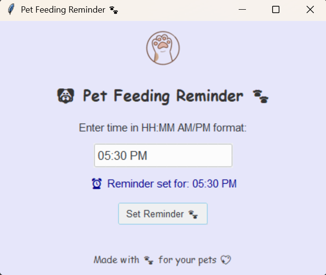
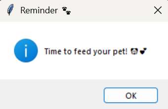

# 🐾 Pet Feeding Reminder 🐶


> A cute and handy desktop app to remind you to feed your pets on time!  

---

## 💡 Features
- ⏰ Set **custom feeding reminders** in `HH:MM AM/PM` format.  
- 🔔 Real-time **desktop notifications** when it’s time to feed your pet.  
- 🎨 **Cute UI** with paw icons and themed colors.  
- ✅ Single reminder at a time with a **status tracker**.  
- 💻 Portable **EXE version** available for Windows.  

---

## 🖥️ Screenshots
  
  
  

---

## Folder structure
```
Pet-Feeding-Reminder/
│
├── dist/                   # Compiled EXE files (ignored in git)
├── paw_transparent.png     
├── petfeeder.py #
├── README.md               
├── .gitignore
```             

---

## 🔧 Tech Stack
-Python 3
-Tkinter (GUI)
-ttkthemes (Modern UI themes)
-Pillow (Image handling)
-PyInstaller (for EXE conversion)

---

## Developed by 
**VAISHNAVI LALAN**

## 🎨 Customization
     -Change theme using ThemedTk(theme="breeze").
     -Replace the paw icon with your own image.
     -Adjust the window size and colors in root.geometry() and root.configure(bg="").

---

## 🚀 EXE Conversion
To convert the Python script into a Windows EXE:

(pyinstaller --onefile --noconsole pet_feeding_reminder.py)

The EXE will be generated in the dist folder.
Make sure the paw image is included in the same folder or use --add-data option with PyInstaller.

---

## 📝 Future Improvements
-Support multiple reminders.
-Add sound notification when feeding time arrives.
-Persistent reminders even after closing the app.
-Add a countdown timer until the next feeding.

---

## 💖 Acknowledgements
-Inspired by pet lovers 🐶🐱
-Icons made with love ❤️
-Thanks to ttkthemes and Pillow for making the UI beautiful.

---

## 📌 License

This project is licensed under the MIT License
